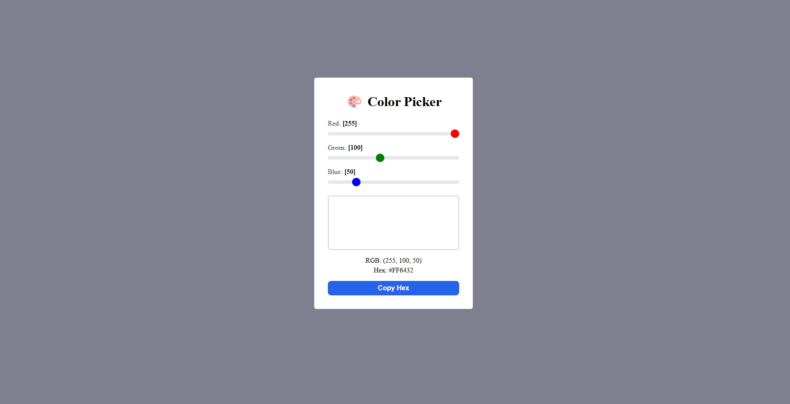

## 🎯 Task 2: Color Picker

**Task:** Create a color picker where RGB sliders update a color preview

**Requirements:**
1. Create parent component `ColorPicker.jsx`
2. Create `RGBSlider.jsx` component (reusable for R, G, B)
3. Create `ColorDisplay.jsx` component to show the color
4. Lift RGB values state to parent
5. Each slider ranges from 0-255
6. Display the RGB values and hex code
7. Show color preview box

**Challenge:** Add a "Copy Hex" button that copies the hex code

**Output:**

